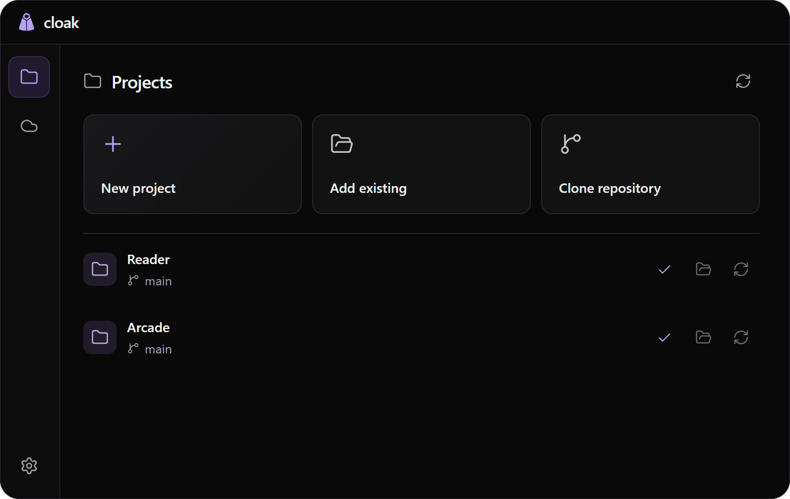

<h1 align="center">Cloak</h1>

Keep Git projects outside OneDrive, with folder links where you work.

<a href="https://github.com/zF4ke/cloak/releases/latest">Download for Windows</a> / <a href="docs/projects.md">Project guide</a> / <a href="docs/cli.md">CLI</a> / <a href="docs/development.md">Development</a>

OneDrive can duplicate source files and corrupt Git metadata while syncing an active repository. Cloak stores the real folder outside OneDrive, uses GitHub for commits, and leaves an optional directory junction in your familiar Projects folder. Editors and terminals can open it normally. The original pause/resume tool remains available for ordinary OneDrive projects.

## Get started

1. Download the installer from [Releases](https://github.com/zF4ke/cloak/releases/latest). It installs for your Windows account without Node or administrator access.
2. Install [Git for Windows](https://git-scm.com/downloads/win) and [GitHub CLI](https://cli.github.com/). Run `gh auth login` and `gh auth setup-git`.
3. Open Settings and choose the real project root outside OneDrive and the Projects folder where you want links.
4. Use Add existing for a local folder, Clone repository for another PC's project, or New project to create one. Review the paths before finishing.

Repositories default to private. Imports include `.git` and ignored local files. Existing destinations are never overwritten. [The project guide](docs/projects.md) explains setup and recovery.

## Keep projects current

Cloak fetches at startup and every five minutes by default. Closing the window keeps it in the tray. Enable Launch at Windows sign-in to check after a restart. Choose Quit from the tray to stop checks.

| Local branch           | Automatic behavior                                   |
| ---------------------- | ---------------------------------------------------- |
| Same commits as origin | Keep local edits.                                    |
| Ahead of origin        | Keep commits and edits.                              |
| Diverged               | Keep everything and report that Git needs attention. |
| Strictly behind origin | Apply the chosen local-edit policy.                  |

**The default policy replaces uncommitted edits when a branch is strictly behind.** It also removes nonignored untracked files. Ignored files such as `.env` normally remain. Choose Keep local edits in Settings if updates should wait instead. Automatic checks never commit or push.

Use Sync to publish work. Select changed files and write a commit message. Other staged files and remaining unselected edits block Sync. See [Updates and Sync](docs/projects.md#updates-and-sync).

## What you can do

- Create GitHub repositories, import whole projects and clone repositories.
- Inspect changes, open folders or GitHub, repair missing links and remove entries without deleting files.
- Use the same project engine from the [CLI](docs/cli.md).
- Keep the original [OneDrive protection](docs/protection.md), log and temporary junction controls.
- Install updates without replacing settings or the project list.

Microsoft does not support syncing symlinks or junctions with OneDrive. Cloak uses junctions at the owner's request and cannot guarantee that every OneDrive version ignores linked contents. Each PC needs its own clone and link. Read [the folder-link decision](docs/adr/002-folder-links.md).

## Guides

| Guide                                | Contents                                               |
| ------------------------------------ | ------------------------------------------------------ |
| [Projects](docs/projects.md)         | Setup, repositories, updates, Sync and another PC.     |
| [CLI](docs/cli.md)                   | Every command and examples.                            |
| [Protection](docs/protection.md)     | Watcher, configuration, logs and manual junction mode. |
| [Installation](docs/installation.md) | Installer, portable build, updates and uninstall.      |
| [Architecture](docs/architecture.md) | Components, stored data and operation flow.            |
| [Development](docs/development.md)   | Run, verify, package and release.                      |
| [Design](docs/design.md)             | Tokens, controls, motion and references.               |
| [Verification](docs/verification.md) | Code reviews, completed checks and remaining limits.   |

Windows x64 is the release target. Binaries are unsigned. Project checks do not install new application releases; run a new Cloak installer manually.
