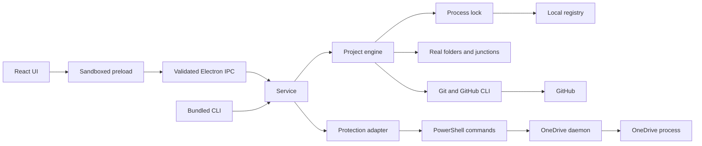

# Architecture

Desktop and CLI share one project engine. The original OneDrive daemon stays separate. No server or cloud database is required.

| Module                   | Owns                                                                                             |
| ------------------------ | ------------------------------------------------------------------------------------------------ |
| `src/ui`                 | Project/setup/settings views, controls and motion. Reads snapshots and invokes explicit actions. |
| `src/app`                | Window, tray, sign-in launch, picker and IPC boundary.                                           |
| `src/core/service.ts`    | Scheduler and command dispatch shared by desktop/CLI.                                            |
| `src/core/projects.ts`   | Registry, imports, links and Git mutation policy.                                                |
| `src/core/git.ts`        | Parsed branch, changes, remote and commit counts.                                                |
| `src/core/lock.ts`       | Mutation coordination across app and CLI.                                                        |
| `src/core/storage.ts`    | JSON registry writes through temporary file and rename.                                          |
| `src/core/protection.ts` | JSONC configuration and PowerShell bridge.                                                       |
| `src/setup`              | App-styled installer and staged file replacement.                                                |
| PowerShell scripts       | Original watcher and temporary junction records.                                                 |

## Operation flow

Setup collects a plan and validates resolved roots, OneDrive boundaries, repository identity and destination/link collisions. It moves, clones or creates the real folder, configures origin, creates a junction and writes the registry. Post-move failures keep the folder with a repairable warning.

An update takes the process lock and reloads the registry. It fetches origin, finds the tracking branch, compares commits and applies policy. HEAD and branch are checked again before replacement. Errors attach to the individual project. Sync optionally commits selected files, requires a clean tree, pulls and pushes.

Cloak publishes an initialized lock directory atomically, avoiding an empty lock if a process crashes during initialization. Recovery renames a dead owner's lock to a tiny `projects.recovered-<token>` record. Keeping that record prevents another stale reader from claiming a replacement live lock. These coordination records contain only a process ID and token. They are not project backups. The lock does not lock external Git clients or editors. Git/GitHub CLI own credentials; Cloak stores paths and settings, not tokens. The renderer has no Node access. Electron verifies its own main frame and dispatches explicit methods.

NSIS extracts setup into temporary storage. The custom Electron installer stages application files, checks that the installed copy is closed, swaps folders and registers Windows integration. User data remains outside `app`. Uninstall targets the fixed local app directory only.

The Vite preview is read-only. The release uses local IPC and does not start an HTTP server. See [the domain glossary](../CONTEXT.md) and [accepted decisions](adr/001-automatic-updates.md).
