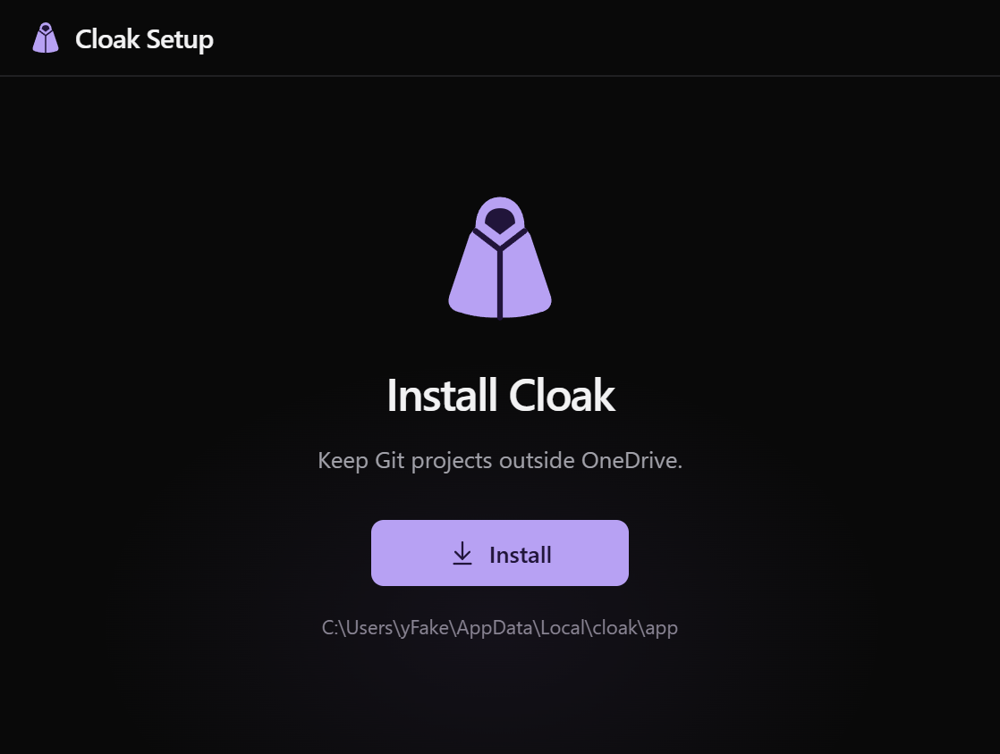

# Installation

Download the Windows x64 installer from [Releases](https://github.com/zF4ke/cloak/releases/latest). Choose Install, then Open Cloak. It uses the app's dark UI and installs per user without Node or administrator access. Git and GitHub CLI are external prerequisites for project operations.

The app installs under `%LOCALAPPDATA%\cloak\app`. Setup creates Start menu entries, registers an uninstaller in Windows Installed apps and adds `cloak` to user PATH. Open a new terminal after setup. Restart a terminal application that caches PATH.

## Update

Choose Quit in the tray menu, then run the new installer. Setup copies files to staging before replacing the app. A registration failure restores the previous application files. Project/settings data lives outside `app` and remains in place. Install Cloak releases manually; project updates do not update the application.

## Portable build

Extract the release's `Cloak-<version>-win-x64.zip` outside OneDrive and open `Cloak.exe`. The included `cloak.cmd` runs its bundled CLI. This creates no Start menu or uninstall entry. It uses the same per-user registry as the installed app. Run only one copy at a time.

## Uninstall

Quit from the tray, then use Windows Installed apps or Uninstall Cloak in the Start menu. This removes app files, app PATH and startup entries. It also stops/removes original protection if installed. Managed projects, junctions and local settings remain. Restore temporary junction-cloaked folders before uninstalling if you want them at their original paths.

| Location under `%LOCALAPPDATA%\cloak` | Contents                                           |
| ------------------------------------- | -------------------------------------------------- |
| `app`                                 | Installed app, bundled CLI and PowerShell scripts. |
| `projects.json`                       | Managed projects and app settings.                 |
| `config.jsonc`                        | Original protection configuration.                 |
| `state.json`                          | Temporary junction records.                        |
| `cloakd.log`                          | Protection activity.                               |
| `scratch`                             | Default temporary junction storage.                |

Windows binaries are unsigned. SHA-256 release checksums identify published files; they are not a signing certificate.
